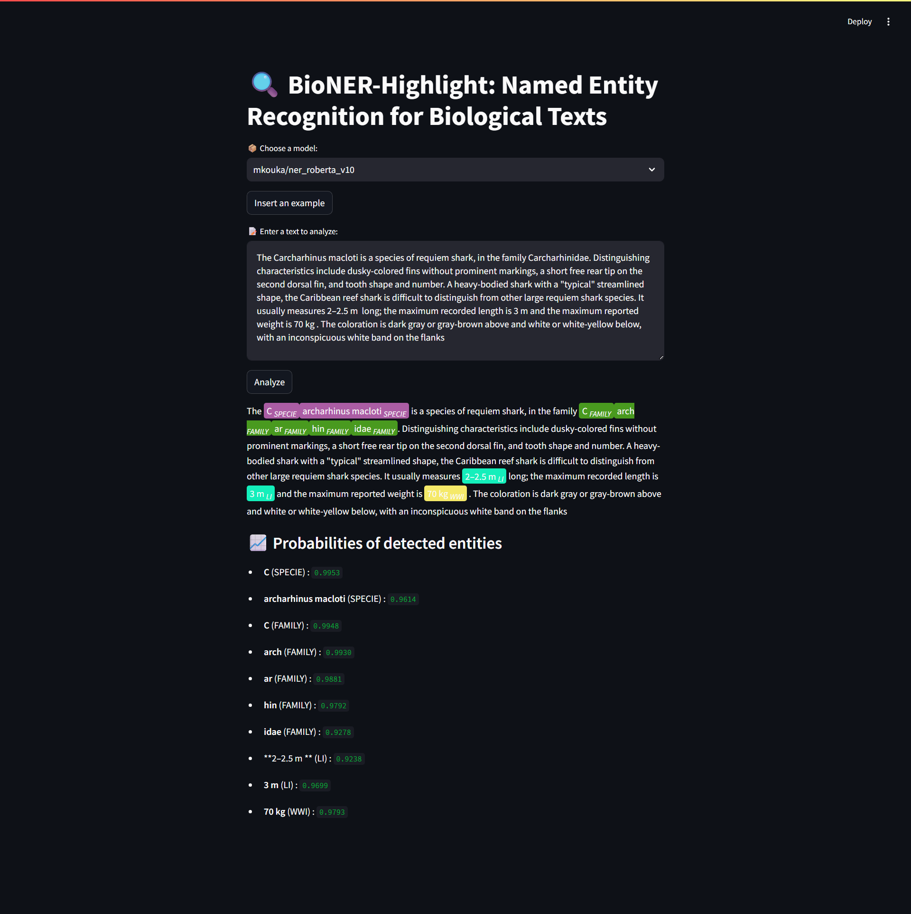

# 🐟 NER-Bio-Fish-RoBERTa

**Named Entity Recognition (NER) for Biological Entities of Fish Species using RoBERTa Fine-Tuning**

This project focuses on developing a domain-specific NER system tailored to fish-related biological entities, leveraging the power of RoBERTa fine-tuning and a custom-annotated dataset collected from Wikipedia and FishBase.

---

## 📌 Table of Contents

- [🧠 Project Description](#-project-description)
- [📊 Dataset](#-dataset)
- [🔬 Methodology](#-methodology)
- [⚙️ Model Training & Evaluation](#️-model-training--evaluation)
- [🧪 Ablation Study](#-ablation-study)
- [🌐 User Interface](#-user-interface)
- [📈 Results](#-results)
- [🚀 Getting Started](#-getting-started)

---

## 🧠 Project Description

This project implements a Named Entity Recognition system that extracts fine-grained biological entities from fish-related texts. The system was fine-tuned on a custom dataset, using a modified version of RoBERTa with a Focal Loss adaptation to better handle class imbalance.

---

## 📊 Dataset

We collected and annotated a domain-specific corpus containing:

- **5,905 samples** (~1.3M tokens) across **2,895 fish species**
- Sources:  
  - Wikipedia: *Species descriptions*  
  - FishBase (via Add-my-Pet references): *Biological traits and taxonomy*

The dataset includes **11 entity types**:

| Entity | Description |
|--------|-------------|
| Specie | Name of the species |
| Family | Taxonomic family |
| ah     | Age at hatching |
| ab     | Age at birth |
| am     | Age at death (life span) |
| Lb     | Length at birth |
| Lp     | Length at puberty |
| Li     | Ultimate length (female) |
| Wwp    | Wet weight at puberty |
| Wwb    | Wet weight at birth |
| Wwi    | Ultimate wet weight |

Annotation was performed using the **DeepSeek Coder R1 API**.

> 📁 See [`data/README.md`](data/README.md) for full details on collection and annotation.

---

## 🔬 Methodology

- Fine-tuned **RoBERTa-base** using token classification
- Custom `Focal Loss` to address class imbalance
- BIO tagging scheme applied to annotated dataset
- Evaluation using **F1-score**, **precision**, and **recall**

---

## ⚙️ Model Training & Evaluation

- **Training Parameters:**
  - Epochs: 5  
  - Learning rate: `2e-5`  
  - Batch size: 16  
  - Weight decay: `0.01`  
  - Device: CUDA-enabled GPU

- The final fine-tuned model is available publicly on the Hugging Face Hub:  
  🔗 [`chaymaaZahedi/bio-ner-roberta`](https://huggingface.co/chaymaaZahedi/bio-ner-roberta/tree/main)

- Final performance:
  - **Global F1 Score**: `0.899`
  - Robust recognition of rare entities such as `Wwb`, `Wwp`, `ah`

---

## 🧪 Ablation Study

We conducted ablation tests with two configurations:
- **Baseline RoBERTa** (no focal loss)
- **RoBERTa + Focal Loss** (ours)

The focal loss model showed clear improvement on underrepresented entity types.

> 📁 See [`test_ablation/`](test_ablation/) for detailed results and comparisons.

---

## 🌐 User Interface

We developed a lightweight web interface using Streamlit that allows:
- Input of raw biological text
- Highlighted display of detected entities in context

This tool facilitates the validation and application of our model in ecological and taxonomic research.

> 📁 See [`interface/`](interface/) to launch the app locally.

---

## 📈 Results

- Detailed evaluation metrics across all 11 entity types
- Learning curves and confusion matrices included in `results/`

---

## 🚀 Getting Started

```bash
git clone https://github.com/your-username/ner-bio-fish-roberta.git
cd ner-bio-fish-roberta

# Launch the interface
cd interface
streamlit run app.py
